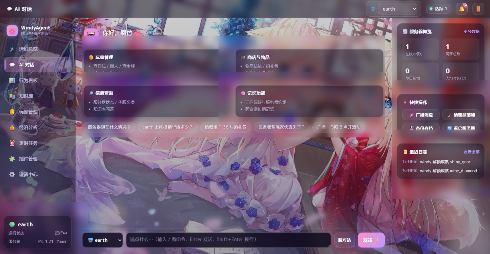
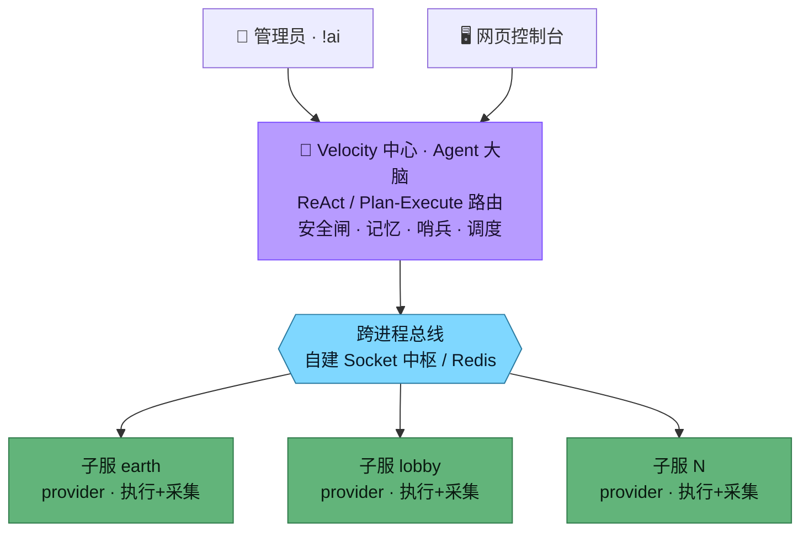

<div align="center">

# 🌸 WindyAgent

**面向 Minecraft 服务器运营的自主 AI Agent**

可替换 LLM 的「服务器大脑」——自然语言运维、主动巡检告警、按计划执行任务，高危操作交回人工审批。
一个 jar 同时是 Velocity 与 Bukkit 插件，无需 Redis 即可组建多服群组。


<br/>



</div>

---

## 简介

WindyAgent 是一个跑在 Minecraft 服务器侧的自主运维 Agent。管理员既可以用自然语言指挥它（`!ai 把刷屏的 Steve 踢了`），也可以让它自己定时巡检、按计划执行任务。

核心设计取向：**能确定化的全部确定化，LLM 只在真正需要「理解」和「判断」的接缝处出场**。因此高频操作零 token、可复现、可审计，同时保留自然语言交互与主动决策能力。

| 任务特征 | 交给谁 |
| --- | --- |
| 可枚举 / 可计算 / 要复现 / 高频 | 确定性代码（命令路由、图传播、规则分群） |
| 开放语言 / 要世界知识 / 模糊意图 | LLM |
| 介于之间（打标、归档、抽取） | LLM 出标签 + 代码出数值 |

> 约 7800 行 Kotlin，110 个源文件，6 个 Gradle 模块。

## 特性

- 🤖 **自然语言运维** — ReAct（简单）/ Plan-Execute（多步）双 Agent，启发式 + LLM 兜底自动路由
- ⚡ **确定性命令** — 首词命中即执行，零 token、可复现，与 LLM 对话共用同一引擎
- 🛰️ **主动运维哨兵** — 定时巡检 TPS / 内存 / 在线 / 掉线，边沿触发告警，异常出 LLM 诊断建议
- ⏰ **定时任务** — 广播 / 命令 / **AI 脚本**（需求→编译成确定性步骤）/ AI 实时（读数据决策）
- 🛡️ **安全闸** — 高危命令人工审批（可在网页/游戏内批，带历史）；玩家侧只读知识库、不挂任何工具
- 🧠 **长期记忆** — 跨会话、跨管理通道共享，写入受信任门槛约束
- 📊 **行为分析** — 防卡采集 + 规则画像 + 分群 + 词云，网页看板（趋势 / 7×24 热力 / 时间线）
- 💰 **物品估值** — EMC 式种子 + 全图传播，人工锚定自动连锁，抗模组增删
- 🔌 **能力自发现** — 子服推送命令目录，中心即插即用，无硬编码子服列表
- 🧪 **技能扩展（Skill）** — 服主放 `SKILL.md` 给 Agent 加能力，免重编译；纯文字流程 / Groovy 脚本两类，网页可视化增删改 + AI 起草 + 测试运行
- 🖥️ **Web 控制台** — 零依赖单页应用（运维总览 / 对话 / 看板 / 知识库 / 定时任务 / 审批）
- 🔄 **可替换 LLM** — OpenAI 兼容 / Claude / Ollama，元任务可配便宜模型省 token

## 架构

中心-提供方拓扑，一个通用 jar 三种形态（`deployment.mode` 切换）：



| 形态 | 说明 |
| --- | --- |
| `provider` | 子服不跑 Agent，连中枢执行下发动作 + 采集本地数据（VC 群组） |
| `standalone` | 单服自带嵌入式 Agent，无总线（单 Paper/Spigot 服） |
| `hub` | 自带 Agent 且当总线中枢（无 Velocity 的多服群组） |

**通用 jar**：`:velocity` 的 shadowJar 把 `:bukkit` 并入同一 fat jar，内含 `velocity-plugin.json` 与 `plugin.yml` 两个入口；丢进 Velocity 或现代 Bukkit 各自识别加载，另一平台主类休眠。

## 技术亮点

- **跨进程总线抽象** — `MessageBus` 接口后藏自建 Socket 中枢（星型拓扑、dial-home、按 requestId 关联回包）/ Redis / 进程内三实现，配置切换零改动，无 Redis 也能组群。
- **无 embedding 的语义检索** — 关键词稀疏（拉丁词 + 中文二元组 + 字段加权）→ 命中弱时 LLM 扩词兜底；向量余弦索引预留接口，配 embedding 即点亮。
- **混合端兼容（Youer / NeoForge）** — 反射拿 NMS `MinecraftServer` 做主线程跳转；无 `getTPS()` 时退 NMS tick 耗时算 TPS；`/neoforge tps` 输出走日志不回 sender，反射挂 log4j Appender 旁路捕获；全程 `runCatching` 降级。
- **防卡行为采集** — 监听器只做 `AtomicLong` 原子自增，后台单线程每 60s 批量落 SQLite，绝不监听 PlayerMove。
- **fat jar 类加载隔离** — shadowJar 重定位 jackson 到私有命名空间 + 合并 SPI，规避与宿主/同居插件的冲突。
- **能力即权限** — 普通玩家的 AI 不挂任何工具（只读知识库），不是「拦住」而是「没那个能力」；无人值守任务高危一律拦截只记录。
- **确定性估值引擎** — 图传播算上千物品秒级且可复现，解析数据与人工锚定分表，抗模组增删。
- **技能即扩展** — 对齐 Anthropic Agent Skills：`SKILL.md`（`name`/`description` + 正文）按需披露，脚本可选。脚本走内嵌 GroovyShell、主线程跳转 + 超时看门狗，与命令/MCP/远端工具共用同一 `AgentTool` 抽象，核心零改动即热插拔。

## 技能扩展（Skill）

让服主**不改源码、不重编译**就给 Agent 加能力——把技能丢进子服的 `skills/` 目录即生效（热重载）。对齐 Anthropic Agent Skills 的形态：一个技能以 `name` + `description` 暴露给 Agent，正文/脚本**按需加载**。两类：

| 类型 | 是什么 | 谁来执行 | 适合 |
| --- | --- | --- | --- |
| 📄 **纯文字** | 一套写给 Agent 的操作流程（Markdown） | Agent 读懂后**用现有工具**办事，不写代码 | 退款流程、开服检查表等可枚举步骤 |
| ⚙️ **脚本+文字** | `SKILL.md` 说清何时/怎么用 + Groovy 脚本 | 调用即跑脚本，干现有工具做不到的事（直调插件 API） | 发礼包、统计背包、调 Vault 等 |

文件形态（任选）：`skills/<名>/SKILL.md`(+脚本) ｜ `skills/<名>.md`(纯文字) ｜ `skills/<名>.groovy`(纯脚本)。

```markdown
---
name: welcome_vip
description: 给指定在线玩家发 VIP 礼包并广播；玩家开通会员时使用
script: script.groovy
args:
  - player: string 目标玩家名
  - coins: int 发放金币数
---
当腐竹说「给某人开 VIP」时调用。脚本注入 server / plugins / actions / args / log，return 回报 Agent。
```

- **安全** — 能往 `skills/` 放文件的即服主，技能视为「已审过的确定性扩展」：不过命令护栏、无人值守也可调，但每次执行记 `audit`；脚本在主线程跑、带超时看门狗。
- **网页可视化** — 控制台「🧪 技能扩展」页：增删改 + **AI 起草**（说人话生成流程型 `SKILL.md`）+ **测试运行**，保存即热重载。
- **跨服** — provider 子服的技能随能力目录推回中心，Agent 用 `search_capabilities` 查、`run_skill_on_server` 调；standalone/hub 本机技能直接成为本地工具。

## 快速开始

```bash
# 构建通用 jar（同时是 Velocity 与 Bukkit 插件）
./gradlew :velocity:shadowJar
# 产物：velocity/build/libs/windyagent-<version>.jar
```

将 jar 放入 Velocity 的 `plugins/`（中心）与各 Bukkit 子服的 `plugins/`（provider），首次启动生成配置后按下方填写，重启即可。

## 配置

`windyagent-config.yml`（节选）：

```yaml
llm:
  provider: openai              # openai 兼容 / claude / ollama
  api-base-url: "https://.../v1"
  api-key: "your-key"
  model: "mimo-v2.5-pro"
  fast-model: ""                # 元任务用的便宜模型，留空=用主模型

deployment:
  mode: provider                # provider | standalone | hub
  server-name: "earth"

cross-server:
  enabled: true
  transport: socket             # socket（自建中枢，无需 Redis）| redis | inprocess
  socket: { host: "127.0.0.1", port: 25599 }

web:
  enabled: true                 # 浏览器访问管理控制台
  host: "127.0.0.1"
  port: 8080
  token: "change-me"

sentinel: { enabled: true }     # 主动运维哨兵
behavior: { enabled: true }     # 玩家行为采集
```

## 模块结构

| 模块 | 职责 | 基线 |
| --- | --- | --- |
| `core` | 平台无关核心：Agent / LLM 抽象 / 安全闸 / 记忆 / 知识库 / 能力注册 / 哨兵 · 调度 / 命令框架 | Java 8 |
| `bus` | 跨进程总线：接口 + Socket 中枢 / Redis / 进程内三实现 | Java 8 |
| `behavior` | 玩家行为数据平台（存储 + 聚合 + 规则画像），平台无关 | Java 8 |
| `web` | Web 控制台后端（JDK HttpServer + 单页），平台无关 | Java 8 |
| `bukkit` | 子服载体：能力提供方 / 嵌入式 Agent / 行为采集 / 物品库 | Java 8 |
| `velocity` | 中心载体（Agent 大脑），产出通用单 jar | Java 11 |

> `core` 刻意降到 Java 8，使 Java 8 的 Bukkit 老服也能直接依赖它挂嵌入式 Agent。

## 技术栈

| 分类 | 选型 |
| --- | --- |
| 语言 | Kotlin |
| 构建 | Gradle 多模块，shadowJar 产出通用 jar |
| LLM | OpenAI 兼容接口 / Anthropic Claude / Ollama（可替换） |
| 存储 | 嵌入式 SQLite（xerial） |
| 序列化 | Jackson |
| 技能脚本 | 内嵌 Groovy（GroovyShell，主线程 + 超时看门狗） |
| 跨进程通信 | 自建 Socket 总线 / Redis |
| 运行平台 | Velocity · Bukkit / Spigot / Paper · 混合端（Youer / Mohist） |

## Roadmap

- [x] 核心 Agent（ReAct / Plan-Execute / 路由）
- [x] 跨服总线 + 能力自发现
- [x] 安全闸 + 人工审批 + 长期记忆
- [x] 行为分析 + 物品估值引擎
- [x] 主动运维哨兵 + 定时任务 + Web 控制台
- [x] 技能扩展（Skill：纯文字 / Groovy 脚本，网页管理 + AI 起草 + 跨服调用）
- [ ] embedding 语义检索（接口已留）
- [ ] 商品定价（待真实成交数据校准）
- [ ] 真实服务器长期压测

## License

Personal project.
